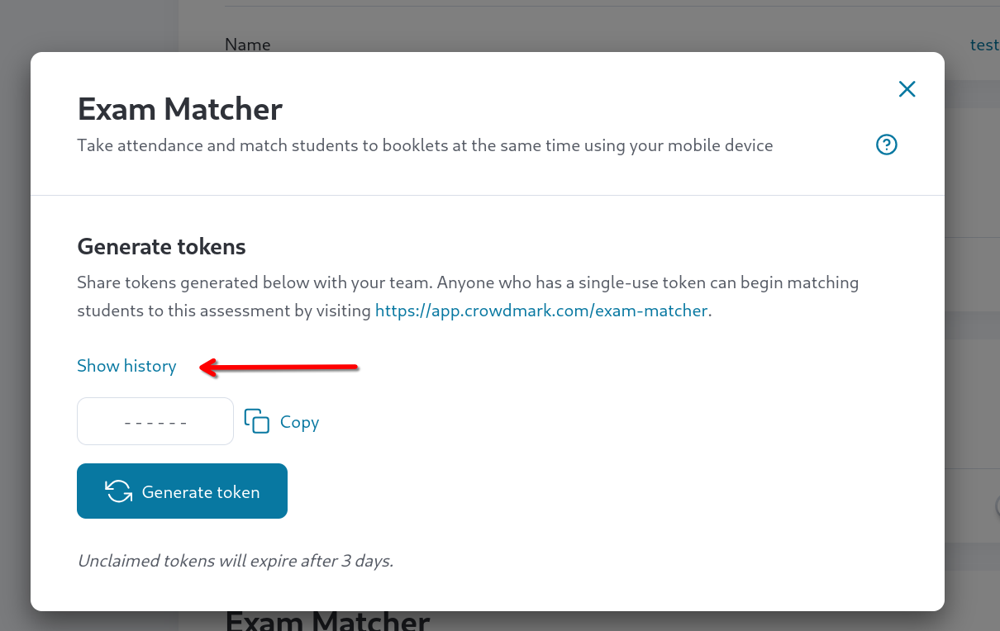
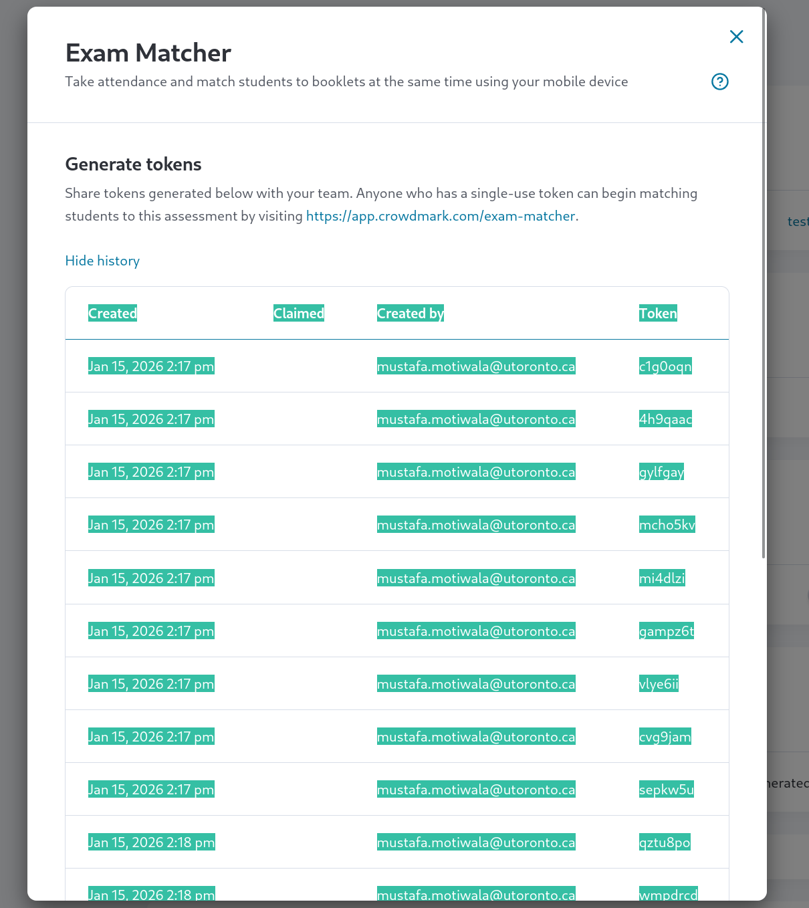
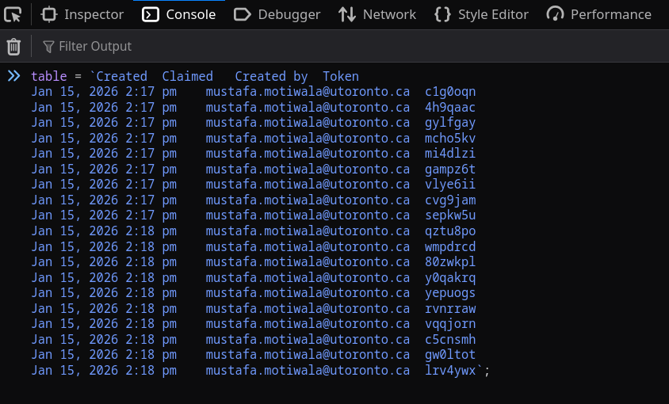

# crowdmark-exam-matcher-userscript
Grab matching statistics for a Crowdmark exam

## Usage Instructions

### Table of Contents

- [Setup](#setup-always-required) (please do this first!)
- [Get matching counts per matcher](#matching-counts-per-matcher)
- [Get matching counts per room](#matching-counts-per-room)
- [Get all available statistics](#full-matching-statistics)

### Setup (always required)

1.  Go to https://app.crowdmark.com/exam-matcher/. **Do not sign in**, it will just be a waste of tokens. 
2. Open up the Javascript console while on the exam-matcher page. There's a different keyboard shortcut for this depending on your browser.
    + Chrome, Edge, Opera (Windows/Linux): `Ctrl` + `Shift` + `J`
    + Chrome, Edge, Opera (Mac): `Command` + `Option` + `J`
    + Firefox (Windows/Linux): `Ctrl` + `Shift` + `K`
    + Firefox (Mac): `Command` + `Option` + `K`
    + Safari (Mac): `Command` + `Option` + `C` (you will have to enable the Develop menu in preferences first)
3. In the console, paste the contents of [script.js](https://raw.githubusercontent.com/motiwalam/crowdmark-exam-matcher-userscript/refs/heads/main/script.js). You may have to follow some additional instructions before the browser will allow you to paste code.
4. Finally, run

    ```js
    await installAuthToken("TOKEN_HERE")
    ```
    with `TOKEN_HERE` replaced by one of the 7-character alphanumeric codes from Crowdmark. 
    
    If this succeeds, there'll be no output. If it fails, it's likely due to the token already having been claimed.
5. You're all set! Keep the Javascript console open as you'll need it to print matching information. **Do not refresh the page** as doing so will mean you have to do the setup all over again (and the token you used to sign in will have been wasted).

### Matching counts per matcher

**Note.** The following assumes you have completed the [setup](#setup-always-required) above. All code should be run inside the Javascript console opened there.

To print a table mapping each matcher to the number of papers they've matched, run

```js
// prints a table mapping each matcher to the total number of papers matched by them
await printPerMatcherCount()
```

### Matching counts per room
**Note.** The following assumes you have completed the [setup](#setup-always-required) above. All code should be run inside the Javascript console opened there.

It is also possible to obtain match counts per room, but due to limitations in the information provided by Crowdmark's API, this first requires providing the script with a list of all available tokens. See [below](#getting-a-list-of-all-tokens-from-crowdmark) for a convenient way to get this list if you have instructor access. 

If `tokens` is a list of tokens (e.g. `["c1g0oqn","4h9qaac","gylfgay"]`), then the following will print a table mapping each room to the number of papers scanned in each room. 

```js
// 'tokens' should be a list of 7-character alphanumeric tokens
// prints a table mapping each room to the total number of papers matched in that room
await printPerRoomCount(tokens)
```

To get accurate counts, it is important that the `tokens` list is a superset of all tokens used by the scanners since this script uses the list to map each scanner to the room they are in. 

**Note.** The script will **not** claim any unclaimed tokens, so it is safe to run the above code at any time.


### Getting a list of all tokens from Crowdmark
**Note.** The following assumes you have completed the [setup](#setup-always-required) above. All code should be run inside the Javascript console opened there.

This script provides a quick way to parse a list of all tokens from the table with the history of all generated tokens that is displayed in Crowdmark.

1. In a different tab, go to the settings page for the relevant assessment on Crowdmark, open the menu used to generate tokens, and click "Show history".

    

2. Copy the resulting table.

    

3. Return to the Javascript console that you opened during the setup. Type ```table = ``;``` and paste the contents of the table you copied in step 2 between the backticks.
    
    **Note.** It is important that you use backticks and not quotes (like `'` or `"`). On English keyboards, the backtick is usually the key immediately to the left of the number 1.

    It should look something like this:

    

    Don't forget to press enter!

4. Finally, you can run

    ```js
    tokens = parseTokensFromTable(table)
    ```

    You should then be able to copy-paste the code from the [per room matching countings](#matching-counts-per-room) or [statistics](#full-matching-statistics) section into the Javascript console.

### Full matching statistics
**Note.** The following assumes you have completed the [setup](#setup-always-required) above. All code should be run inside the Javascript console opened there.

To get all of the statistics used in computing the tables described above, run

```js
await getStatistics()
```

You can optionally pass in a list of tokens (as described [above](#matching-counts-per-room)):

```js
await getStatistics(tokens)
```

This is a lot of information and probably not that useful, unless you want to see which specific students were matched by which people.
